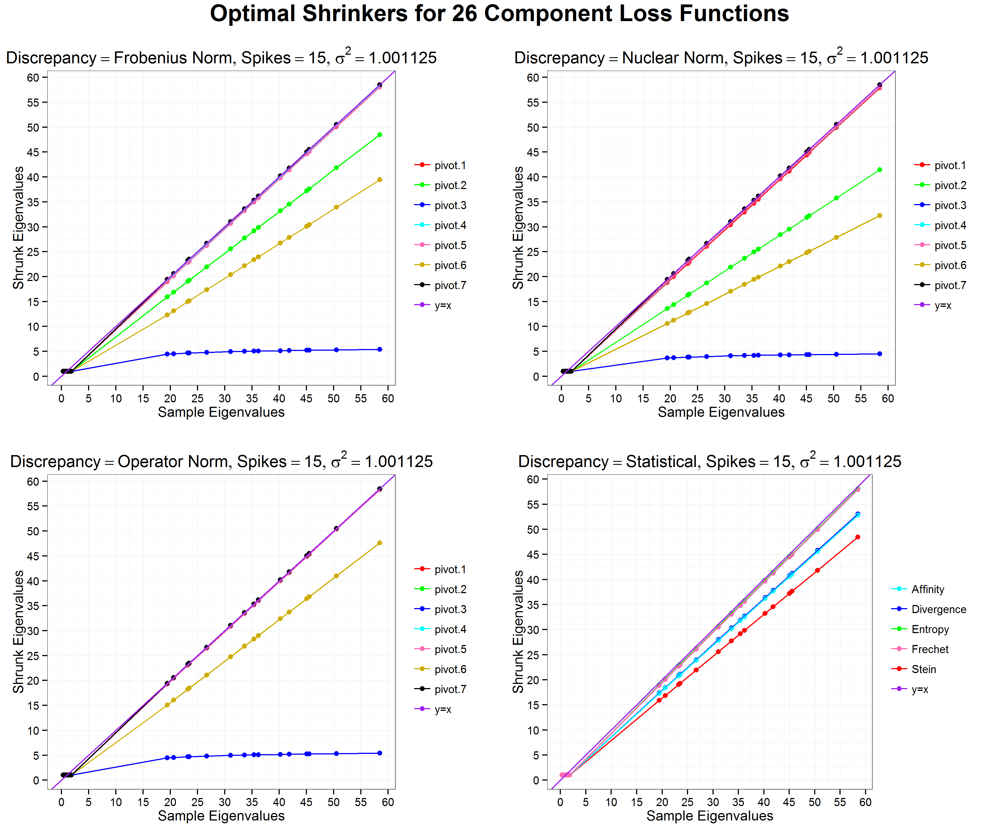

$\pagebreak$

```{r setup, include=FALSE}

knitr::opts_chunk$set(fig.pos="h")
knitr::opts_chunk$set(cache.path='./CovarianceEstimation_cache/')
```


```{r load_packages, results='hide', echo=FALSE, warning=FALSE, error=FALSE, message=FALSE}
library(knitcitations)
cleanbib()
options("citation_format" = "pandoc")

library(covmat)
library(xts)
library(robust)

library(PortfolioAnalytics)
library(covmat)
library(rmgarch)
```

#Load Package

The latest version of the $\texttt{covmat}$ package can be downloaded and installed through the following command:
```{r load, eval=FALSE}
library(devtools)
install_github("arorar/covmat")
```

```{r doi, echo=FALSE, warning=FALSE, error=FALSE, message=FALSE}
bib <- read.bibtex("references.bib")
```

#Stambaugh Estimator

Longer monthly return data series are often available from well-established companies. However, if we turn to newer companies we run into the problem of unequal histories where newer companies have shorter return histories. To calculate a covariance matrix for portfolio optimization with assets having unequal histories we can naively truncate the data to the largest available cross-section. This means discarding data. However, we can do better with using all available data for all assets using a methodology proposed by `r citep(bib[["Stambaugh_1997"]])`.

##Data

Say that we have a portfolio of 4 tech stocks $\texttt{TWTR, LNKD, V, YHOO, GE}$  of which only 2 have a return history of 6 years, while the other 3 have been around for less than four years. 

```{r load-data, echo=FALSE, results='hide', warning=FALSE, error=FALSE, message=FALSE}

data("missingdata")
symbols <- c('TWTR', 'LNKD', 'V', 'YHOO', 'GE')
symdata <- missingdata["2007-04-01/2014-12-31",symbols]

```

Lets start by visualizing the data. We can use the $\texttt{plotmissing}$ function to do this. The second parameter of this function allows us to choose how we want to visualize the data. A value of 3 suggests a time series plot and 4 suggests a matrix plot. 

```{r, eval=FALSE}
plotmissing(data, which=c(3,4))
```

We will choose to visualize the timeseries in this case


```{r visual-missing, echo=FALSE, fig.width=10, fig.height=6}
plotmissing(symdata, 3)

```
\

$\newline$

Notice how some return series have missing values and shorter lengths compared to other series. In particular Twitter recently had its IPO and has a large number of missing values. LinkedIn had its IPO in 2011 and has lesser missing values. While GE and Yahoo have complete data histories and no missing values for the period under consideration.


##Covariance estimation
To construct a valid covariance matrix we could truncate the data series making all of them about a year long and then calculate the sample covariance matrix. However, we can do better by using Stambaugh's method. Starting from the truncated sample covariance matrix, this technique produces improvements to the covariance matrix that utilizes all the available data along with using cross sectional dependency in returns data to construct a more accurate covariance matrix.

Firstly, we will use the $\texttt{stambaugh.fit}$ function to construct the covariance matrices. This function takes in data and the type of covariance matrix that needs to be estimated. Additional arguments can be passed for robust estimation.

```{r, eval=FALSE}
stambaugh.fit(R, method=c("classic","robust", "truncated"), ...)
```

Let us compare a classical covariance matrix computed using Stambaugh's technique with a truncated classical covariance estimator.  

```{r fit-model, warning=FALSE, error=FALSE, message=FALSE}
models1 <- stambaugh.fit(symdata, method = c("classic", "truncated"))
```

## Plots

We can construct two types of plots, an ellipses plot and a distance plot. Each can be separately invoked using the same $\texttt{plot}$ function but a separate $\texttt{which}$ parameter.

```{r, eval=FALSE}
plot(data, which=c(1,2))
```

We can visually compare the covariances by examining their correlations using the ellipses plot. The ellipses are contours of standard bivariate normals overlayed for each model. Notice that the ellipses for truncated data can be significantly different from ellipses for covariance estimates computed using Stambaugh's technique. The difference is very prominent for certain pairs such as LinkedIn and GE where the sign of the correlation has completely reversed.


```{r plot-ellipse1, warning=FALSE, error=FALSE, message=FALSE, fig.width=10, fig.height=6}
plot(models1,1)
```
\

We will also compare the covariances of Stambaugh and Robust Stambaugh methods. Once again notice how the ellipses of Twitter and GE are significantly different.

```{r plot-ellipse2, warning=FALSE, error=FALSE, message=FALSE, fig.width=10, fig.height=6}
cov.control <- covRob.control(estim="mcd",alpha=0.9)
models <- stambaugh.fit(symdata, method = c("classic", "robust"), 
                        cov.control=cov.control)
plot(models, 1)
```
\

We can also look at the distances of the individual stocks to examine the outliers for the same dataset.  Notice that we will not use truncated models in this case for comparison as they have different data. Also we will pass a control parameter for robust covariance estimation. For outlier detection we need to evaluate the tail probability for a Chi-Square distribution. We will set it to 97.5%. This is indicated by the dashed line on the plot.


```{r plot-distance, warning=FALSE, error=FALSE, message=FALSE, fig.width=10, fig.height=5.5}

plot(models, 2, 0.975)

```
\

$\newline$

Notice how classical method suggests fewer outliers compared to Robust method. All outliers indicated by Classical method are also suggested as an outlier by the Robust method. Additional outliers indicated by the Robust method may be further examined.

# FMMC estimator

A different approach to the problem of computing estimates for unequal return histories was proposed by `r citep(bib[["Jiang2013"]])`. In this case we use longer factor histories of many risk factors and and choose a subset to construct a risk model for the asset returns. We can then simulate from such a risk model to construct longer return histories and use them to construct more accurate measure of covariance. 

##Data

For factors we will use the 5 factor model `r citep(bib[["Fama2014"]])`. The five factor time series model tries to capture the market effect, size effect, value effect, profitability effect, and investment quality effect for a stock. In addition to the five factors we will also include the momentum factor as proposed in `r citep(bib[["Carhart1997"]])`. All data for the factors is publicly available on Kenneth French's website.[^1]

In addition to these we will also add a liquidity factor proposed in `r citep(bib[["Pastor2003"]])`. Data for which is freely available on Pastor's website.[^2]

We will also add a volatility factor by constructing the first order difference in VIX.

[^1]: http://mba.tuck.dartmouth.edu/pages/faculty/ken.french/
[^2]: http://faculty.chicagobooth.edu/lubos.pastor/research/

The factor data and symbol data is stored in the package and can be loaded as follows

```{r load-data-fmmc, results='hide', warning=FALSE, error=FALSE, message=FALSE}

data("missingdata")
data("factordata")

```

Let us consider a portfolio of 3 stocks $\texttt{LNKD, V, LAZ}$  all of which have different return histories. We need to align these series to the monthly factor data. The alignment can be done as follows

```{r align, results='hide', warning=FALSE, error=FALSE, message=FALSE}
symbols <- c('LNKD', 'V', 'YHOO')
symdata <- missingdata["2007-04-01/2014-12-31",symbols]
symdata <- symdata["2007-04-01/2014-12-31",symbols]

dates.sym.monthly <- format(index(symdata), "%Y%m")
dates.factors.monthly <- format(index(factor.data), "%Y%m")
index(symdata) <- index(factor.data)[which(dates.factors.monthly 
                                           %in% dates.sym.monthly)]

```

##Covariance estimation

To construct the covariance matrix we will use the $\texttt{fmmc.cov}$ function. This function takes an xts object of return series, an xts object of factor series and an align parameter. We emphasize that the simulated returns from different asset returns although longer are still unequal in length. The align parameter can be used to truncate data from the beginning or end to align all longer histories to the same length. 

```{r, eval=FALSE}
fmmc.cov(R, factors, robust = FALSE, parallel = TRUE, 
                    align=c("end", "begin"), ...)
   
```

We can construct the covariance matrix as follows. Additional arguments can be passed to construct a robust covariance matrix. Notice that the parallel flag is turned on because FMMC is an embarrassingly parallel problem. Longer histories for each asset can be computed at the same time using all available cores of the CPU.

```{r FMMC, warning=FALSE, error=FALSE, message=FALSE}

fmmc <- fmmc.cov(symdata, factor.data, parallel = FALSE)

```

## Plots
We can also compare the performace of FMMC with the naive approach of constructing covariance estimates based on truncated data. Notice how FMMC estimates give a significantly different result from trucnated estimates for Lazard and Visa.

```{r fmmc-plot, , fig.width=10, fig.height=6}

compareCov(fmmc, cov(na.omit(symdata)),c("FMMC","Truncated"))

```
\


# Denoising using Random Matrix Theory

Random matrix theory provides a way to de-noise the sample covariance matrix . Let X be a matrix with T rows and N columns random matrix. C is the sample correlation matrix. Under the random matrix assumption, the eigenvalues of C must follow a Marchenko-Pastur density such that $N,T\rightarrow \infty, Q=N/T$. The density of eigenvalues is given by $$f\left( \lambda  \right) = \frac{Q}{2\pi \lambda {\sigma ^2}}\sqrt {\left( {{\lambda _{max}} - \lambda } \right)\left( {\lambda  - {\lambda _{\min }}} \right)}$$

For a random matrix all eigenvaules will be within the range. The variance of these eigenvalues is 1. If any eigenvalue lies outside $\lambda_{max}$ it is considered as a signal. We can choose these eigenvalues and replace the eigenvalues within the cutoff with either an average value or completely ignore them.


## Data
To demonstrate the use of Random Matrix theory we will choose the $\texttt{dow30data}$ object which contains daily returns for ow Jones 30 index for a year.

```{r rmt-load}

data("dow30data")

```

## Covariance estimation

To fit a covariance matrix we can use the $\texttt{estRMT}$ fucntion.

```{r, eval=FALSE}

estRMT(R, Q =NA, cutoff = c("max", "each"), 
       eigenTreat = c("average", "delete") , 
       numEig=1, parallel = TRUE)

```
This function takes serveral options, details of which can be found on the man page. However, in the simplest case we can pass a timeseries object of assets. In such a case we will assume that we know the largest eigenvalue and fit the distribution to the remaining eigenvalues. Values less than the cutoff are replaced with an average value.

```{r rmt-est, echo=FALSE, warning=FALSE, error=FALSE, message=FALSE}
model <- estRMT(dow30data, parallel=FALSE)

```
   
## Plots

Once we have fitted a model we can also investigate the fit visually using the $\texttt{plot}$ function. The plot function takes in a fitted model and plots the fitted density overlayed on a histogram. It also displays some important fit parameters.

```{r rmt-plot, fig.width=8, fig.height=4, fig.keep='last'}

plot(model)

```
\


## Evaluation

We will now demonstrate the use of RMT with a more elaborate example. Let us build a custom portfolio stratey using all 30 stocks from the Daily Dow Jones 30 index. We will use $\texttt{dow30data}$ object that contains daily data from 04/02/2014 to 07/10/2015. We will use the $\texttt{PortfolioAnalytics}$ package for building the portfolio and backtesting  the strategy. 


Let us first construct a custom moment function where covariance is built by denoising using Random Matrix Theory. We assume no third/fourth order effects.

```{r rmt-custommoment}

custom.portfolio.moments <- function(R, portfolio) {
  momentargs <- list()
  momentargs$mu  <-  matrix(as.vector(apply(R,2, "mean")), ncol = 1)
  momentargs$sigma  <-  estRMT(R, parallel=FALSE)$cov
  momentargs$m3 <- matrix(0, nrow=ncol(R), ncol=ncol(R)^2)
  momentargs$m4 <- matrix(0, nrow=ncol(R), ncol=ncol(R)^3)

  return(momentargs)
}
```


We will construct a portfolio with the following specficatiion. No short sales are allowed. All cash needs to be invested at all times. As our objective, we will seek to maximize the quadratic utility which maximizes returns while controlling for risk. 

```{r rmt-portfoliospec}

pspec.lo <- portfolio.spec(assets = colnames(dow30data))

#long-only
pspec.lo <- add.constraint(pspec.lo, type="full_investment")
pspec.lo <- add.constraint(pspec.lo, type="long_only")

pspec.lo <- add.objective(portfolio=pspec.lo, type="return", name="mean")
pspec.lo <- add.objective(portfolio=pspec.lo, type="risk", name="var")

```


Now lets backtest our strategy using an ordinary covariance matrix and a covariance matrix build by denoising using Random Matrix theory. 

```{r rmt-run, warning=FALSE, error=FALSE, message=FALSE, eval = FALSE}

opt.ordinary <- 
  optimize.portfolio.rebalancing(dow30data, pspec.lo, 
                                 optimize_method="quadprog",
                                 rebalance_on="months", 
                                 training_period=120,
                                 trailing_periods=120)
opt.rmt <- 
  optimize.portfolio.rebalancing(dow30data, pspec.lo, 
                                 optimize_method="quadprog",
                                 momentFUN = "custom.portfolio.moments",
                                 rebalance_on="months", 
                                 training_period=120, 
                                 trailing_periods=120)
```


We can now extract weights and build cummulative returns using the $\texttt{PerformanceAnalytics}$ package.

```{r rmt-results, eval = FALSE}

ordinary.wts <- na.omit(extractWeights(opt.ordinary))
ordinary <- Return.rebalancing(R=dow30data, weights=ordinary.wts)

rmt.wts <- na.omit(extractWeights(opt.rmt))
rmt <- Return.rebalancing(R=dow30data, weights=rmt.wts)

rmt.strat.rets <- merge.zoo(ordinary,rmt)
colnames(rmt.strat.rets) <- c("ordinary", "rmt")

```

```{r rmt-results-main,  results='hide', echo=FALSE, warning=FALSE, error=FALSE, message=FALSE}

filepath <- "./CovarianceEstimation_cache/rmt_strategy_rets.RData"

if (file.exists(filepath)) {
  load(filepath)
} else {
  opt.ordinary <- 
  optimize.portfolio.rebalancing(dow30data, pspec.lo, 
                                 optimize_method="quadprog",
                                 rebalance_on="months", 
                                 training_period=120,
                                 trailing_periods=120)
  opt.rmt <- 
    optimize.portfolio.rebalancing(dow30data, pspec.lo, 
                                   optimize_method="quadprog",
                                   momentFUN = "custom.portfolio.moments",
                                   rebalance_on="months", 
                                   training_period=120, 
                                   trailing_periods=120)
  
  ordinary.wts <- na.omit(extractWeights(opt.ordinary))
  ordinary <- Return.rebalancing(R=dow30data, weights=ordinary.wts)
  
  rmt.wts <- na.omit(extractWeights(opt.rmt))
  rmt <- Return.rebalancing(R=dow30data, weights=rmt.wts)
  
  rmt.strat.rets <- merge.zoo(ordinary,rmt)
  colnames(rmt.strat.rets) <- c("ordinary", "rmt")
  
  save(rmt.strat.rets, file = filepath)
}
                              
```

In the chart below we can see that  the cumulative returns generated using our strategy with
filtering using Random Matrix Theory are superior to ordinary returns. They are also better with smaller drawdowns. This suggests that there is value in filtering a large sample covariance matrix before using it for optimizing portfolios.

```{r rmtstratplots}
charts.PerformanceSummary(rmt.strat.rets,wealth.index = T, 
                          colorset = c("red","blue"), 
                          main=paste(c("Comparison of Portflio ",
                                     "Performance using two ",
                                     "different covariance matrices"),
                                     collapse=""), cex.legend = 1.3, 
                          cex.axis = 1.3, legend.loc = "topleft")

```
\


# Independent Switching Dynamic Conditional Correlation Model

The IS-DCC model from `r citep(bib[["Lee_2010"]])` has the same structure as the DCC model but it lets the constants be state dependent and hence makes it possible to model
time-varying correlation with different dynamics for each regime. The model runs a separate DCC process for each state in parallel and avoids the path dependency problem and makes the model tractable.

Fitting the IS-DCC model to data corresponds to a two step process, where the first step is to estimate the volatility of each univariate time series separately using GARCH(1,1), as in the case for DCC. The second step corresponds to estimating the DCC(1,1) parameters for each state and estimating the transition probabilities corresponding to the Hidden Markov Model. This is done by maximising the log likelihood using the Expectation Maximization (EM) algorithm.

## Data
To demonstrate the use of IS-DCC we will choose the $\texttt{etfdata}$ object which contains daily returns for 9 exchange traded funds (SPDRs) that represent the U.S. stock market from S&P, i.e. XLE, XLY, XLP, XLF, XLV,XLI, XLB, XLK and XLU. The Sector SPDRs divide the S&P 500 into nine sector index funds. The returns on assets are considered to be dependent on regimes which are in turn defined by market conditions. Daily returns on the ETFs from January 1, 2008 to December 31, 2010 were retrieved from Yahoo Finance.


```{r isdcc-load}

data("etfdata")

```

## Covariance estimation

To fit a covariance matrix we can use the $\texttt{isdccfit}$ fucntion.

```{r, eval=FALSE}

isdccfit(R, numRegimes, transMatbounds = c(2,10), 
         dccBounds = c(0,1), w = NA, ...) 

```
This function takes serveral options, details of which can be found on the man page. However, in the simplest case we can pass a timeseries object of asset returns and the number of regimes that we want to fit to the data. Since we use Expectation Maximization to fit data, convergence can be slow and additional parameters must be passed to the optimizer to speed by computation. We use $\texttt{DEoptim}$ to fit paramters. If no control paramters are passed we use the $\texttt{lhs}$ package to generate initial paramters uniformaly in the paramters space and pass it as initial population to $\texttt{DEoptim}$. 

Let us fit a simple model for demonstration that fits three regimes to the data. 

```{r isdcc-est, echo=FALSE, warning=FALSE, error=FALSE, message=FALSE, eval=FALSE}
model.isdcc <- isdccfit(etfdata, numRegimes=3, parallelType = 1, itermax = 100)

```

```{r isdcc-est-main, results='hide' ,echo=FALSE, warning=FALSE, error=FALSE, message=FALSE}

filepath <- "./CovarianceEstimation_cache/isdcc_model.RData"
if (file.exists(filepath)) {
  load(filepath)
} else {
  model.isdcc <- isdccfit(etfdata, numRegimes=3, parallelType = 1, itermax = 100)
  save(model.isdcc, file = filepath)
}

```
   
## Plots

Once we have fitted a model we can also investigate the regimes by examining the implied states using the $\texttt{plot}$ function. The plot function takes in a fitted model and and the type of plot. It then plots either the implied states or the implied probability of regimes.

```{r isdcc-plot, fig.width=8, fig.height=4, fig.keep='last'}

plot(model.isdcc)

```
\


## Evaluation

We will now build a custom portfolio stratey using $\texttt{etfdata}$. We will use a simple strategy such that at each period we will choose the covariance matrix from the regime which has the highest probability of occurance. We will benchmark the strategy against the ordinary DCC model that does not use regimes. 

Let us first construct two custom moment functions where covariance is built using DCC and IS-DCC

```{r isdcc-custommoment}

custom.portfolio.moments.isdcc <- function(R, portfolio) {
  
  momentargs <- list()
  momentargs$mu  <-  matrix(as.vector(apply(R,2, "mean")), ncol = 1)
  
  result <- isdccfit(R, numRegimes = 2, itermax=100)
  ldate <- as.character(tail(index(R),1))
  maxProbIndex <- which.max(result$filtProb[ldate,])
  momentargs$sigma  <-  result$cov[[ldate]][[maxProbIndex]]
  
  momentargs$m3 <- matrix(0, nrow=ncol(R), ncol=ncol(R)^2)
  momentargs$m4 <- matrix(0, nrow=ncol(R), ncol=ncol(R)^3)
  
  return(momentargs)
}


custom.portfolio.moments.dcc <- function(R, portfolio) {
  
  momentargs <- list()
  momentargs$mu  <-  matrix(as.vector(apply(R,2, "mean")), ncol = 1)
  
  garch11.spec <- ugarchspec(mean.model = list(armaOrder = c(0,0)), 
                            variance.model = list(garchOrder = c(1,1)
                                          , model = "sGARCH"), 
                            distribution.model = "norm")
  
  dcc.garch11.spec <- dccspec(uspec = multispec( replicate(ncol(R), 
                                                  garch11.spec) ), 
                             dccOrder = c(1,1), distribution = "mvnorm")
  
  dcc.fit <- dccfit(dcc.garch11.spec, data = R)
  momentargs$sigma  <-  rcov(dcc.fit)[,,as.character(tail(index(R),1))]
  
  momentargs$m3 <- matrix(0, nrow=ncol(R), ncol=ncol(R)^2)
  momentargs$m4 <- matrix(0, nrow=ncol(R), ncol=ncol(R)^3)
  
  return(momentargs)
}

```

We will construct a portfolio with the following specficatiion. No short sales are allowed. All cash needs to be invested at all times. As our objective, we will seek to maximize the quadratic utility which maximizes returns while controlling for risk. 

```{r isdcc-portfoliospec}

datap <- etfdata["2009-07/"]

pspec.lo.isdcc <- portfolio.spec(assets = colnames(datap))

#long-only
pspec.lo.isdcc <- add.constraint(pspec.lo.isdcc, type="full_investment")
pspec.lo.isdcc <- add.constraint(pspec.lo.isdcc, type="long_only")

pspec.lo.isdcc <- add.objective(portfolio=pspec.lo.isdcc, 
                                type="return", name="mean")
pspec.lo.isdcc <- add.objective(portfolio=pspec.lo.isdcc, 
                                type="risk", name="var")

```

Now lets backtest our strategy using an ordinary covariance matrix and covariance matrices built using DCC and IS-DCC models.

```{r isdcc-run, warning=FALSE, error=FALSE , message=FALSE, results='hide', eval=FALSE}

ordinary <- 
  optimize.portfolio.rebalancing(datap, pspec.lo.isdcc, 
                                 optimize_method="quadprog",
                                 rebalance_on="months", 
                                 training_period=120,
                                 trailing_periods=120)

opt.dcc <- 
  optimize.portfolio.rebalancing(datap, pspec.lo.isdcc, 
                                  optimize_method="quadprog",
                                  momentFUN = 
                                   "custom.portfolio.moments.dcc",
                                  rebalance_on="months",
                                  training_period=120,
                                  trailing_periods=120)

opt.isdcc <- 
  optimize.portfolio.rebalancing(datap, pspec.lo.isdcc, 
                                          optimize_method="quadprog",
                                          momentFUN = 
                                   "custom.portfolio.moments.isdcc",
                                          rebalance_on="months",
                                          training_period=120,
                                          trailing_periods=120)
```


We can now extract weights and build cummulative returns using the $\texttt{PerformanceAnalytics}$ package.

```{r isdcc-results,  eval=FALSE}

ord.wts <- na.omit(extractWeights(ordinary))
ord <- Return.rebalancing(R=datap, weights=ord.wts)

dcc.wts <- na.omit(extractWeights(opt.dcc))
dcc <- Return.rebalancing(R=datap, weights=dcc.wts)

isdcc.wts <- na.omit(extractWeights(opt.isdcc))
isdcc <- Return.rebalancing(R=datap, weights=isdcc.wts)

isdcc.strat.rets <- merge.zoo(merge.zoo(ord, dcc), isdcc)
colnames(isdcc.strat.rets) <- c("ordinary", "dcc", "isdcc")

```


```{r isdcc-results-main,  results='hide', echo=FALSE, warning=FALSE, error=FALSE, message=FALSE}

filepath <- "./CovarianceEstimation_cache/isdcc_strategy_rets.RData"
if (file.exists(filepath)) {
  load(filepath)
} else {
  ordinary <- 
  optimize.portfolio.rebalancing(datap, pspec.lo.isdcc, 
                                 optimize_method="quadprog",
                                 rebalance_on="months", 
                                 training_period=120,
                                 trailing_periods=120)

  opt.dcc <- 
    optimize.portfolio.rebalancing(datap, pspec.lo.isdcc, 
                                    optimize_method="quadprog",
                                    momentFUN = 
                                     "custom.portfolio.moments.dcc",
                                    rebalance_on="months",
                                    training_period=120,
                                    trailing_periods=120)

  opt.isdcc <- 
    optimize.portfolio.rebalancing(datap, pspec.lo.isdcc, 
                                            optimize_method="quadprog",
                                            momentFUN = 
                                     "custom.portfolio.moments.isdcc",
                                            rebalance_on="months",
                                            training_period=120,
                                            trailing_periods=120)

  ord.wts <- na.omit(extractWeights(ordinary))
  ord <- Return.rebalancing(R=datap, weights=ord.wts)
  
  dcc.wts <- na.omit(extractWeights(opt.dcc))
  dcc <- Return.rebalancing(R=datap, weights=dcc.wts)
  
  isdcc.wts <- na.omit(extractWeights(opt.isdcc))
  isdcc <- Return.rebalancing(R=datap, weights=isdcc.wts)
  
  isdcc.strat.rets <- merge.zoo(merge.zoo(ord, dcc), isdcc)
  colnames(isdcc.strat.rets) <- c("ordinary", "dcc", "isdcc")
  
  save(isdcc.strat.rets, file = filepath)
}

```


In the chart below we can see that  the cumulative returns generated using our strategy with
IS-DCC model are superior to ordinary returns as well as returns by the DCC model. This suggests that there is value in assuming the presence of regimes in data and exploring the idea further while optimizing portfolios.

$\newline$
```{r isdccstratplots, fig.width=10, fig.height=8}
charts.PerformanceSummary(isdcc.strat.rets,wealth.index = T,
                          colorset = c("red","blue","green"), 
                          main=paste(c("Comparison of Portflio ",
                                     "Performance using two ",
                                     "different covariance matrices"),
                                     collapse=""), cex.legend = 1.3, 
                          cex.axis = 1.3, legend.loc = "topright") 
```
\


# Eigenvalue Shrinkage in Spiked Covariance Model

The MLE estimator of covariance matrix is not an accurate estimator when the ratio of number of variables to observations is large. It distorts the eigenstructure of the population covariance matrix such that the largest sample eigenvalue is biased upward and the smallest sample eigenvalue is biased downward. However, empirical eigenvalues can be improved by shrinkage. `r citep(bib[["Donoho2013"]])` assume that the population covariance matrix follows a spiked covariance model and construct scalar non-linear shrinkers which shrink eigenvalues greater than the bulk edge of the Marchenko Pastur distribution and set values within bulk to 1. 26 loss functions under different losses and matrix norms are considered.

## Data
To demonstrate the use of shrinkage in Spiked Covariance model we will choose the $\texttt{rmtdata}$ object which contains simulated data with multivariate normal distribution. The data is generated as follows. We first generate a spiked covariance matrix with 100 dimensions and the following 15 eigenvalues as spikes, $\lambda\in\left\{48,\,46,\,44,\,42,\,40,\,38,\,36,\,34,\,32,\,30,\,28,\,26,\,24,\,22,\,20\right\}$.Our spiked covariance model is as follows

$$C=\sum_{\lambda_{i}\in\lambda}\lambda_{i}v_{i}v_{i}^{\top}+I_{100}$$

We will use the spiked covarianve matrix from above and generate 500 observations from a multivarite nornal distribution. This object is saved for ease of use and is called as $\texttt{rmtdata}$.


```{r rmtdata-load}

data("rmtdata")

```

## Covariance estimation

To fit a covariance matrix we can use the $\texttt{estSpikedCovariance}$ fucntion.

```{r, eval=FALSE}

estSpikedCovariance(R, gamma = NA, 
                      numOfSpikes = NA,
                      method = c("KNTest", "median-fitting"),
                      norm = c("Frobenius", "Operator", "Nuclear"),
                      pivot = 1, statistical = NA,
                      fit = NA) 

```

This function takes serveral options. In the simplest case we can pass a timeseries object of asset returns where all other parameters assume default value. The parameter gamma if missing is set to the ratio of variables to observations. For time series data, the choice of gamma can be important and one may want to control it such that the block of returns under consideration is stationary. If numOfSpikes is missing, then it is estimated using two methods, KNTest or median-fitting. In case of median-fitting we first count the number of breaks in the emperical histogram of eigenvalues using the Freedman-Diaconis algorithm. The initial number of spikes are calculated by counting the number of eigenvalues in the breaks after the first zero. The initial number of spikes are used to match the bulk edge and estimate $\sigma^{2}$. This serves as an lower bound for $\sigma^{2}$. $\sigma^{2}$  calculated by assuming no spikes is used as an upper bound. We then estimate variance by minimizing the absolute distance between the true median of the MP distribution and the median of the eigenvalues within the bulk. The details of KNTest desribed in `r citep(bib[["Kritchman_2009"]])`.

## Plots

We can investigate the peformance of 26 shrinkers by plotting them simultaneoulsy

```{r spike-plot, eval=FALSE}

  plotSpikedCovariance(rmtdata)

```

```{r spike-plot-main,  results='hide',  echo=FALSE, warning=FALSE, error=FALSE, message=FALSE, fig.show='hide'}

filepath <- "./CovarianceEstimation_cache/Shrinkage.png"
if (!file.exists(filepath)) {
  png(file = filepath, width = 12, height = 10, units = "in", res = 300)
  plotSpikedCovariance(rmtdata)
  dev.off()
}

```
\



#References
```{r references, echo=FALSE, warning=FALSE, error=FALSE, message=FALSE, echo=FALSE}
#write.bibtex(file="references.bib")
```
